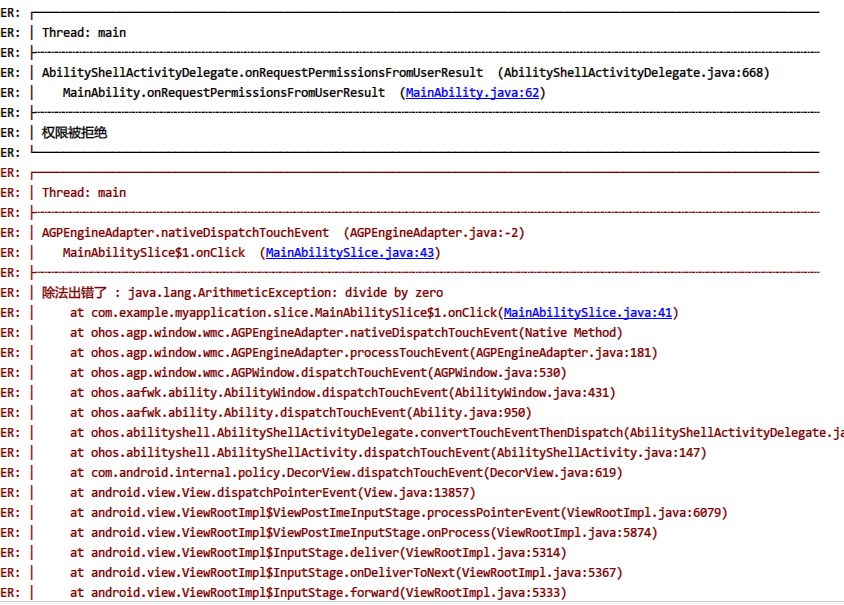

# HiLogger
简单.美观.实用的日志打印工具类
Simple, pretty and powerful logger for XXXX

该项目参考
https://github.com/orhanobut/logger.git
在使用形式上尽可能保持一致.只需将类名由Logger替换成HiLogger.

### 使用步骤 (Setup)

#### 下载源码 (Download)

```
复制项目src目录下  copy to your project src
```

####  初始化 (Initialize)

​		在AbilityPackage中onInitialize()方法里面初始化

```java
HiLogger.addLogAdapter(new HMOSLogAdapter(0x333) {
     @Override  //debug模式下输出日志
     public boolean isLoggable(int priority, String tag) {
           return BuildConfig.DEBUG;
     }
});
```

更高级一点的用法,可以初始化输出格式
```java
 FormatStrategy formatStrategy = PrettyFormatStrategy.newBuilder()
.showThreadInfo(false)
.methodCount(0)
.tag("MyTag")
.build();

HiLogger.addLogAdapter(new HMOSLogAdapter(formatStrategy,0x333) {
     @Override  //debug模式下输出日志
     public boolean isLoggable(int priority, String tag) {
           return BuildConfig.DEBUG;
     }
});
```
如果需要保存输出到日志文件:
```java
HiLogger.addLogAdapter(new DiskLogAdapter(this)); //this 为AbilityContext类型
```

日志文件默认保存在:

  /data/user/0/[应用包名]/logger/logs_0.csv, logs_0.csv默认按500k大小对日志进行分名保存.如logs_1.csv,logs_2.csv,logs_3.csv....依次类推

####  使用 (And use)
在需要打印日志的地方
```java
HiLogger.d("hello");
HiLogger.i("hello");
HiLogger.w("hello");
HiLogger.e("hello");


or 

import static com.talkweb.logger.HiLogger.*;
 d("应用未被授予权限");
 i("应用未被授予权限");
 w("应用未被授予权限");
 e("应用未被授予权限");
```

### 输出效果 (Output)



### 更多可选API (Options)

#### 字符串参数  (String format arguments are supported)

```java
HiLogger.d("hello %s", "world");
```

#### 常见集合对象  (Collections are supported)

```java
HiLogger.d(MAP);
HiLogger.d(SET);
HiLogger.d(LIST);
HiLogger.d(ARRAY);

example:
HiLogger.d(Arrays.asList("foo", "bar"));
```


####  JSON对象  (Json  support )
```java
HiLogger.json("{ \"key\": 3, \"value\": \"something\"}");
HiLogger.json("[{ \"key\": 3, \"value\": \"something\"}]");

ZSONObject jsonObj = new ZSONObject();
jsonObj.put("1", "aaa");
jsonObj.put("2", "bbb");

ZSONObject jsonObjWapper = new ZSONObject();
jsonObjWapper.put("JJ",jsonObj);
HiLogger.json(jsonObjWapper);

ZSONArray jsonArray = new ZSONArray();
jsonArray.add(jsonObj);
HiLogger.json(jsonArray);
```


### 与原库功能对比 (contrast)

| 功能 | HiLogger |  logger    |
| ---- | -------- | ---- |
| d/i/v/w/e/wtf等方法     |   支持       |   支持   |
| list/set/array     |    支持      | 支持     |
| map     |    支持      | 支持     |
| json     |    支持      | 支持     |
| xml     |   不支持       |  支持    |
| 输出到logcat    |   支持(输出到HiLog面板)       |  支持    |
| 输出到文件     |   支持       |  支持    |


